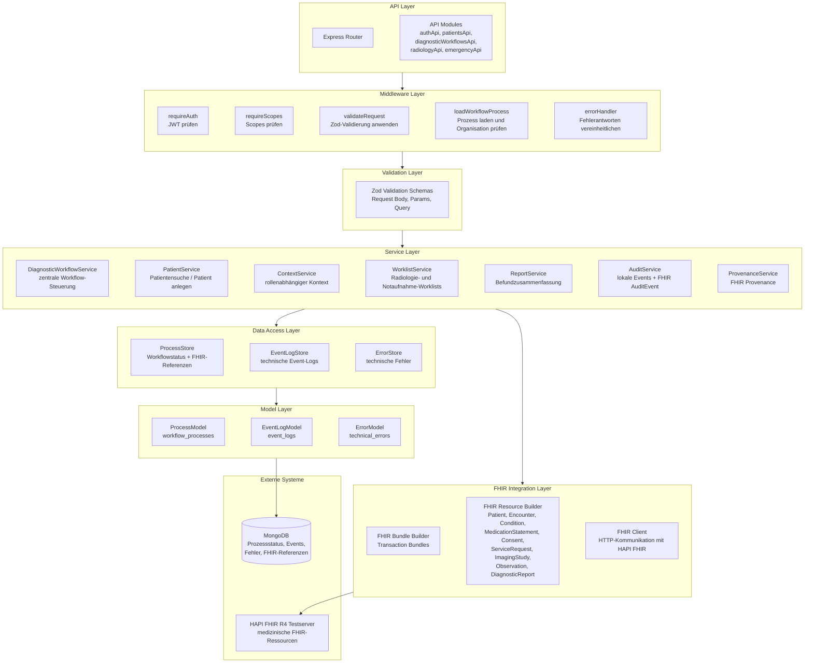

# Planungsdokument – Vertical Slice A: Diagnostik & Befunddokumentation

## 1. Einleitung

Für das Modul Medizinische Informationssysteme sollen wir einen Vertical Slice eines medizinischen Informationssystems implementieren. Unser gewählter Slice ist Slice A: Diagnostik & Befunddokumentation.

Der Slice soll einen begrenzten, aber vollständigen Ausschnitt eines Krankenhausvorgangs abbilden.

Der Prozess besteht grob aus folgenden Schritten:

1. Eine Patientin oder ein Patient wird in der Notaufnahme aufgenommen.
2. Patientenstammdaten, Consent und Anamnese werden erfasst.
3. Eine Röntgenuntersuchung wird angefordert.
4. Die Bildgebung wird in der Radiologie registriert.
5. Der Befund wird dokumentiert und dem Vorgang zugeordnet.
6. Der Vorgang wird abgeschlossen und auditierbar gemacht.

---

## 2. Ziel des Vertical Slice und fachliche Einordnung

Am Anfang haben wir uns die Frage gestellt, welche Rolle unser System in einer realen Krankenhauslandschaft eigentlich einnehmen bzw repräsentieren soll. Denn ein medizinisches Informationssstem besteht üblicherweise nicht nur aus einem einzigen System, sondern aus mehreren Systemen und Modulen. Dazu gehören zum Beispiel KIS, PACS, Laborinformationssysteme und weitere Spezialsysteme. Diese Frage war grundlegend für alle späteren Architekturentscheidungen. Denn sie beeinflusst welche Datenflüsse abgebildet werden, welche Akteure eine Rolle spielen, welche Auswirkungen das für uns bezüglich Datenschutz hat und vieles mehr.

Da unser Projekt nur ein Vertical Slice ist, können wir die Realität nicht vollständig nachbauen. Deshalb haben wir uns entschieden, dass unser Backend als ein vereinfachtes KIS-/Radiologie-Backend bzw. als eine Integrations- und Workflow-Schicht verstanden werden soll.

Wichtig für die späteren Architekturnetscheidungen war dabei auch, dass wir uns von dem medizinischen Entscheidungsprozess abgrenzen wollen. Unser System soll keine Frakturen erkennen, keine Diagnosen stellen und keine echten DICOM-Bilder auswerten. Die medizinischen Entscheidungen selbst kommen immer von fachlichen Akteuren außerhalb unseres Systems, zum Beispiel vom Notaufnahme-Arzt, von der technischen Radiologie oder vom Radiologen.
Unser Backend soll stattdessen die Informationsverarbeitung des in unserem touchpoint dargestellten medizinischen Prozesses übernehmen. Es soll also dokumentieren, was im Prozess passiert, die Reihenfolge der Schritte prüfen und die passenden FHIR-Ressourcen erzeugen.

Diese Einordnung war sehr wichtig, weil daraus später die Entscheidungen zur Datenspeicherung und zum Datenschutz entstanden sind. Wenn unser System keine medizinischen Entscheidungen trifft, sondern nur einen Prozess steuert und dokumentiert, muss es auch nicht alle sensiblen medizinischen Inhalte lokal speichern.

---

## 3. Grundidee der Architektur

Für die Architektur musste zuerst die Frage geklärt werden, ob unser Backend nur eine technische Weiterleitung an FHIR sein, oder ob es eine eigene fachliche API bereitstellen soll.

Eine einfache Lösung wäre es gewesen, die FHIR-Endpunkte des HAPI-Servers fast direkt an den Client weiterzureichen. Dann hätte der Client selbst Ressourcen wie `Patient`, `Condition`, `ServiceRequest`, `Observation` oder `DiagnosticReport` erstellen müssen.

Das würde aber bedeutet, dass der Client dann sehr viel über FHIR wissen müsste. Er müsste zum Beispiel wissen, wie ein `DiagnosticReport` aufgebaut ist, wie dieser eine `ImagingStudy` referenziert und welche Ressourcen mit Patient und Encounter verbunden werden müssen. Das wäre dann eher ein FHIR-Proxy-Server als ein eigenes medizinisches Informationssystem.

Deshalb haben wir die API als fachliche Fassade geplant. Wir bieten Endpunkte an, die die fachliche Schritte des Prozesses repräsentieren sollen. Die FHIR-Ressourcen werden dabei komplett intern im Backend erzeugt und verwaltet, der Client muss nichts darüber wissen.

Wir verzichten also bewusst auf Endpunkte wie:

```http
POST /Patient
POST /Condition
POST /MedicationStatement
POST /ServiceRequest
POST /DiagnosticReport
```

## 4. Fachlicher Schnitt des Workflows

Bei der Struktur des Workflows musste festgelegt werden, ob der komplette Vorgang über einen einzigen großen Endpunkt ausgeführt wird oder ob mehrere Endpunkte sinnvoller sind.

Ein einzelner großer Endpunkt wäre technisch an manchen Stellen einfacher gewesen. Man hätte alle Daten auf einmal schicken können und das Backend hätte daraus alle FHIR-Ressourcen erzeugt. Fachlich passt das aber nicht gut, weil in einem echten Krankenhausprozess nicht alle Daten gleichzeitig von anfang an bereit liegen.

Deshalb haben wir uns entschieden den Workflow in mehrere fachliche Schritte zu unterteilen:

1. Aufnahme und Anamnese
2. Röntgenauftrag
3. ImagingStudy-Stub
4. Befunddokumentation

Diese Aufteilung macht den Prozess realistischer. Außerdem kann das Backend dadurch den aktuellen Status speichern und prüfen, ob ein Schritt gerade erlaubt ist. Ein Befund darf zum Beispiel erst erstellt werden, wenn vorher eine ImagingStudy registriert wurde.

---

## 5. Datenspeicherung, Datenschutz und Datenminimierung

Eine zentrale Frage unseres Systems ist die Datenspeicherung und der Datenschutz. Wir müssen uns damit auseinandersetzen, welche Daten wir für den Ablauf wirklich benötigen, welche davon lokal gespeichert werden müssen, welche Daten besonders sensibel sind und welche Daten wir überhaupt verarbeiten dürfen.
Dabei orientieren wir uns an den Grundprinzipien der DSGVO, besonders am Prinzip der Datenminimierung. Für unser System bedeutet das, dass wir möglichst vermeiden wollen, inhaltliche Patientendaten lokal zu speichern. Es soll also keine zweite lokale Patientenakte in MongoDB entstehen.
Stattdessen soll unser System so gestaltet werden, dass lokal nur die Informationen gespeichert werden, die für die Prozesssteuerung, Nachvollziehbarkeit und Auditierbarkeit notwendig sind. Dazu gehören vor allem technische Metadaten, Prozessstatus, Zeitstempel, Event-Logs, Fehlercodes und FHIR-Referenzen.
Die eigentlichen medizinischen Fachdaten, wie Patientendaten, Vorerkrankungen, Medikamente oder radiologische Befunde, sollen nur im FHIR-Server gespeichert werden. Unser Backend speichert lokal nur Verweise auf diese Ressourcen und nutzt diese, um den Workflow über mehrere Schritte hinweg fortzuführen.

Das Ziel dieser Entscheidung ist, den Workflow trotzdem technisch durchführen und auditieren zu können, ohne medizinische Klartextdaten in unserer lokalen DB zu duplizieren. Dadurch wird das Risiko reduziert, dass sensible Patientendaten an mehreren Stellen geschützt werden müssen.


Der FHIR-Server speichert die eigentlichen medizinischen Ressourcen:

```text
* Patient,
* Encounter,
* Condition,
* MedicationStatement,
* Consent,
* ServiceRequest,
* ImagingStudy,
* Observation,
* DiagnosticReport,
* AuditEvent,
* Provenance.
```

MongoDB speichert nur technische Informationen, die für Workflow-Steuerung und Nachvollziehbarkeit nötig sind.

Zum Beispiel:

```
* `processId`,
* `transactionId`,
* aktueller Workflow-Status,
* `organizationId`,
* Hash der KVNR,
* FHIR-Referenzen wie `Patient/123`,
* Event-Typen,
* Fehlercodes,
* HTTP-Statuscodes,
* Zeitstempel.
```

Die KVNR wird nur zur Laufzeit benötigt, um im FHIR-Server nach Patientendaten zu suchen. Lokal speichern wir nur einen Hash, zum Beispiel:

```text
kvnrHash = SHA-256(kvnr)
```

FHIR-Referenzen sind dabei nicht komplett anonym, weil man mit Zugriff auf den FHIR-Server wieder auf medizinische Daten kommen kann. Trotzdem enthalten sie weniger Klartextinformationen als Namen, Diagnosen oder Befundtexte. Sie werden lokal gespeichert, weil sie für die Fortführung des Workflows notwendig sind.

---

## 6. Rollen und Berechtigungen

Während wir uns mit Datenschutz und Datenminimierung beschäftigt haben, stellte sich uns auch noch die Frage, wer greift eigentlich wann auf unsere API zu und welche Berechtigungen besitzen diese Akteure um die von unserem Backend herausgegeben Daten einzusehen.

Aus dieser Frage heraus entwarfen wir ein Rollenmodell. Unterschiedliche Akteure übernehmen im Prozess unterschiedliche Aufgaben und sollen deshalb auch nicht dieselben Rechte bekommen.

Die Aufnahme bzw. Pflege in der Notaufnahme erfasst Patientendaten und Anamnese. Der Notaufnahme-Arzt erstellt den Röntgenauftrag. Die technische Radiologie registriert die Bildgebung. Der Radiologe erstellt den Befund. Ein Auditor kann später technische Events und FHIR-Referenzen prüfen.

Für unseren vertical slice haben wir uns auf folgende Rollen geeinigt:

| Rolle         | Bedeutung                                  |
| ------------- | ------------------------------------------ |
| `ER_NURSE`    | Aufnahme und Anamnese in der Notaufnahme   |
| `ER_DOCTOR`   | Arzt in der Notaufnahme                    |
| `RAD_TECH`    | radiologische technische Durchführung      |
| `RADIOLOGIST` | Radiologe / Befundung                      |
| `AUDITOR`     | Audit, Datenschutz und Nachvollziehbarkeit |
| `ADMIN`       | technische Administration                  |

Die Rolle `ER_NURSE` steht bei uns für die Aufnahme und das Erfassen des Anamnesebogens. Alternativ wäre auch `ER_INTAKE` möglich gewesen. Wir haben uns aber für `ER_NURSE` entschieden, weil der Schritt nicht nur rein administrativ ist, sondern auch Anamneseinformationen erfasst werden.

Wichtig ist außerdem der Unterschied zwischen `RAD_TECH` und `RADIOLOGIST`.

`RAD_TECH` steht für die technische Durchführung in der Radiologie. Diese Rolle registriert also die Bildgebung bzw. die `ImagingStudy`.

`RADIOLOGIST` steht für den oder die Radiologin. Diese Rolle interpretiert die Bildgebung und erstellt den Befund, also `Observation` und `DiagnosticReport`.

Die Berechtigungen werden nicht nur über Rollen, sondern auch über Scopes abgebildet. Ein Benutzer bekommt beim Login ein JWT, in dem seine Rolle und seine Scopes stehen (Dazu später mehr im Auth Abschnitt).

Das Backend prüft bei geschützten Endpunkten:

1. Ist ein JWT vorhanden?
2. Ist das JWT gültig?
3. Hat der Benutzer den passenden Scope?
4. Gehört der Vorgang zur gleichen Organisation?
5. Ist der Workflow-Status für diese Aktion erlaubt?

Dadurch reicht es nicht, nur eine bestimmte Rolle zu haben. Ein `RADIOLOGIST` darf zwar grundsätzlich Befunde erstellen, aber nicht, wenn der Prozess noch gar nicht bei der Befundung angekommen ist.

---

### 6.1 Berechtigungsmatrix

Aus den Rollen und Scopes ergibt sich folgende Berechtigungsmatrix. Sie hilft dabei, die Endpunkte fachlich sauber abzusichern.

| Endpoint                                                    | Benötigter Scope           |    `ER_NURSE` | `ER_DOCTOR` | `RAD_TECH` | `RADIOLOGIST` | `AUDITOR` |  `ADMIN` |
| ----------------------------------------------------------- | -------------------------- | ------------: | ----------: | ---------: | ------------: | --------: | -------: |
| `POST /api/auth/login`                                   | -                          |            ja |          ja |         ja |            ja |        ja |       ja |
| `GET /api/auth/me`                                       | gültiges JWT               |            ja |          ja |         ja |            ja |        ja |       ja |
| `POST /api/patients/search`                              | `patient:search`           |            ja |          ja |       nein |          nein |      nein |     nein |
| `POST /api/diagnostic-workflows`                         | `intake:create`            |            ja |    optional |       nein |          nein |      nein |     nein |
| `GET /api/diagnostic-workflows/{id}`                     | `workflow:read`            |            ja |          ja |         ja |            ja |        ja | optional |
| `GET /api/diagnostic-workflows/{id}/context`             | `context:read`             | eingeschränkt |          ja |         ja |            ja |      nein |     nein |
| `POST /api/diagnostic-workflows/{id}/radiology-orders`   | `radiology-order:create`   |          nein |          ja |       nein |          nein |      nein |     nein |
| `GET /api/radiology/worklist`                            | `radiology-worklist:read`  |          nein |    optional |         ja |            ja |      nein |     nein |
| `POST /api/diagnostic-workflows/{id}/imaging-studies`    | `imaging-study:create`     |          nein |        nein |         ja |      optional |      nein |     nein |
| `POST /api/diagnostic-workflows/{id}/diagnostic-reports` | `diagnostic-report:create` |          nein |        nein |       nein |            ja |      nein |     nein |
| `GET /api/emergency/worklist`                            | `emergency-worklist:read`  |            ja |          ja |       nein |          nein |      nein |     nein |
| `GET /api/diagnostic-workflows/{id}/report-summary`      | `report:read`              |          nein |          ja |       nein |            ja |      nein |     nein |
| `GET /api/diagnostic-workflows/{id}/events`              | `audit:read`               |          nein |        nein |       nein |          nein |        ja | optional |
| `GET /api/diagnostic-workflows/{id}/fhir-references`     | `fhir-references:read`     |          nein |        nein |       nein |          nein |        ja | optional |

Die Matrix zeigt zum Beispiel, dass `RAD_TECH` zwar eine ImagingStudy registrieren darf, aber keinen Befund erstellen darf. `AUDITOR` darf Events und FHIR-Referenzen lesen, aber keine medizinischen Inhalte verändern.

---

## 7. API-Endpunktplanung

Die API-Endpunkte wurden so geplant, dass sie fachliche Schritte im Prozess darstellen und keine einzelnen FHIR-CRUD-Operationen.

### 7.1 Aufnahme und Anamnese

Dieser Schritt ist der Startpunkt, weil jeder Vorgang mit Patientendaten und Anamnese beginnt. Es wurde bewusst kein eigener Endpunkt für `Patient`, `Condition`, `MedicationStatement` und `Consent` erstellt, weil das zu sehr nach FHIR-CRUD aussehen würde.

```http
POST /api/diagnostic-workflows
```

Fachliche Eingaben:

* synthetische KVNR oder Demo-Identifier,
* Patientenstammdaten,
* Consent,
* Vorerkrankungen,
* Dauermedikamente.

Intern erzeugt oder verwendet das Backend:

* Patient,
* Encounter,
* Condition,
* MedicationStatement,
* Consent,
* AuditEvent,
* Provenance.

Der Client sendet also einen fachlichen Aufnahme-Request. Das Backend entscheidet intern, ob ein Patient gesucht oder neu erstellt wird und wie die FHIR-Ressourcen gespeichert werden.

---

### 7.2 Röntgenauftrag

Der Röntgenauftrag ist ein eigener Schritt, weil er eine ärztliche Entscheidung darstellt. Er ist noch kein Ergebnis, sondern eine Anforderung an die Radiologie.

```http
POST /api/diagnostic-workflows/{processId}/radiology-orders
```

Fachliche Eingaben:

* angeforderte Untersuchung,
* Körperregion,
* Begründung.

Intern erzeugt das Backend:

* ServiceRequest,
* AuditEvent,
* Provenance.

Der Client muss Patient und Encounter nicht selbst referenzieren. Das Backend kennt diese Informationen aus dem laufenden Prozess.

---

### 7.3 ImagingStudy-Stub

Dieser Schritt steht für die radiologische Durchführung bzw. Registrierung der Bildgebung.

```http
POST /api/diagnostic-workflows/{processId}/imaging-studies
```

Da keine echten DICOM-Daten verarbeitet werden sollen, ist die ImagingStudy nur ein Stub.

Fachliche Eingaben:

* Beschreibung,
* Modalität, zum Beispiel `XR`,
* Startzeitpunkt.

Intern erzeugt das Backend:

* ImagingStudy,
* AuditEvent,
* Provenance.


---

### 7.4 Befunddokumentation

Die Befunddokumentation ist der letzte fachliche Schritt. Die Befunddaten entstehen nicht automatisch aus dem Auftrag, sondern durch die radiologische Interpretation.

```http
POST /api/diagnostic-workflows/{processId}/diagnostic-reports
```

Fachliche Eingaben:

* strukturierte Befundwerte,
* Befundzusammenfassung bzw. Conclusion.

Intern erzeugt das Backend:

* Observation,
* DiagnosticReport,
* AuditEvent,
* Provenance.

Der DiagnosticReport wird mit Patient, Encounter, ServiceRequest, ImagingStudy und Observation verknüpft. Danach wird der Workflow abgeschlossen.

---

### 7.5 Radiologie-Worklist

Die Radiologie kennt in der Realität nicht zufällig eine `processId`. Deshalb wurde eine Worklist als fachliche Leseschnittstelle geplant.

```http
GET /api/radiology/worklist
```

Für `RAD_TECH` zeigt die Worklist offene Röntgenaufträge, bei denen eine ImagingStudy registriert werden muss.
Für `RADIOLOGIST` zeigt die Worklist registrierte Bildgebungen, bei denen noch ein Befund erstellt werden muss.

Die Worklist ist keine direkte FHIR-Suche wie, stattdessen liefert das Backend eine fachliche Aufgabenliste.

---

### 7.6 Notaufnahme-Worklist

Auch die Notaufnahme soll sehen können, welche Vorgänge relevant sind.

```http
GET /api/emergency/worklist
```

Die Worklist zeigt zum Beispiel Vorgänge, bei denen ein radiologischer Befund fertig ist und vom Notaufnahme-Arzt angesehen werden kann.

---

### 7.7 Context-Endpunkt

Der Context-Endpunkt soll dem nächsten Akteur die minimal notwendigen Informationen geben.

```http
GET /api/diagnostic-workflows/{processId}/context
```

Dabei werden die Kontextdaten nicht dauerhaft in MongoDB gespeichert. Das Backend lädt bei Bedarf FHIR-Ressourcen, reduziert sie rollenabhängig und gibt nur den benötigten Ausschnitt zurück.

Beispiel:

```json
{
  "processId": "process_123",
  "status": "IMAGING_STUDY_REGISTERED",
  "context": {
    "order": {
      "procedure": "Röntgen Hand rechts",
      "bodySite": "rechte Hand"
    },
    "imaging": {
      "description": "Röntgenaufnahme rechte Hand",
      "modality": "XR"
    }
  },
  "nextStep": {
    "action": "CREATE_DIAGNOSTIC_REPORT",
    "requiredFields": ["findings", "conclusion"]
  }
}
```

Damit bekommt der Radiologe genug Kontext für die Befundung, ohne dass MongoDB Befundtexte oder andere medizinische Klartextdaten speichern muss.

---

### 7.8 Weitere Lese-Endpunkte

Zusätzlich werden folgende Endpunkte geplant:

```http
GET /api/diagnostic-workflows/{processId}
GET /api/diagnostic-workflows/{processId}/events
GET /api/diagnostic-workflows/{processId}/fhir-references
GET /api/diagnostic-workflows/{processId}/report-summary
```

`GET /diagnostic-workflows/{processId}` gibt den aktuellen Status zurück.

`GET /events` ist für Audit und Nachvollziehbarkeit gedacht.

`GET /fhir-references` zeigt die gespeicherten FHIR-Referenzen.

`GET /report-summary` lädt den fertigen Befund aus FHIR und gibt ihn berechtigten Rollen zurück.

---

Ja, dafür würde ich einen kurzen Abschnitt nach dem **fachlichen Schnitt des Workflows** oder bei der **API-Endpunktplanung** einbauen. Inhaltlich passt er gut zwischen Workflow-Aufteilung und Fehlerbehandlung, weil die Statuswerte später für Endpunkte, Worklists und Fehlerfälle wichtig sind.

So könntest du es formulieren:

---

## 8. Workflow-Status

Damit der mehrstufige Prozess über mehrere API-Aufrufe hinweg gesteuert werden kann, braucht jeder Vorgang einen aktuellen Status. Dieser Status wird lokal in MongoDB beim Prozess gespeichert. Er beschreibt, an welcher Stelle sich der Workflow gerade befindet.

Die Statuswerte sind wichtig, weil das Backend damit prüfen kann, welcher Schritt als Nächstes erlaubt ist. Ein radiologischer Befund darf zum Beispiel erst erstellt werden, wenn vorher eine ImagingStudy registriert wurde. Dadurch verhindert das Backend fachlich falsche Reihenfolgen.

Für unseren Vertical Slice sind folgende Statuswerte geplant:

```text
INTAKE_COMPLETED
RADIOLOGY_ORDER_CREATED
IMAGING_STUDY_REGISTERED
SUCCESS
ERROR
```

### `INTAKE_COMPLETED`

Dieser Status entsteht nach dem Aufnahme- und Anamnese-Schritt.
Das bedeutet, dass Patientendaten, Consent und Anamnese erfolgreich verarbeitet wurden.

Der nächste fachliche Schritt ist der Röntgenauftrag.

```text
nächster Status: CREATE_RADIOLOGY_ORDER
```

---

### `RADIOLOGY_ORDER_CREATED`

Dieser Status entsteht, nachdem der Notaufnahme-Arzt den Röntgenauftrag erstellt hat.
Intern wurde dabei ein FHIR `ServiceRequest` erzeugt und mit Patient und Encounter verknüpft. Dieser Status zeigt der Radiologie, dass ein Auftrag vorliegt und nun eine Bildgebung registriert werden kann.

Der nächste fachliche Schritt ist das Bildgebungsverfahren.

```text
nächster Status: REGISTER_IMAGING_STUDY
```

---

### `IMAGING_STUDY_REGISTERED`

Dieser Status entsteht, nachdem die Radiologie die Bildgebung registriert hat.
Intern wurde dabei eine FHIR `ImagingStudy` erzeugt. Für den Workflow bedeutet dieser Status, dass die Bildgebung vorhanden ist und nun der Radiologe den Befund dokumentieren kann.

Der nächste fachliche Schritt ist die Befund-Dokumentation.

```text
nächster Status: CREATE_DIAGNOSTIC_REPORT
```

---

### `SUCCESS`

Dieser Status bedeutet, dass der komplette Diagnostik- und Befundworkflow erfolgreich abgeschlossen wurde.

Er entsteht, nachdem der Radiologe den Befund dokumentiert hat. Intern wurden dabei `Observation` und `DiagnosticReport` erzeugt und mit Patient, Encounter, ServiceRequest und ImagingStudy verknüpft.
Nach diesem Status gibt es keinen weiteren fachlichen Schreibschritt mehr. Der Befund kann aber zum Beispiel über die Notaufnahme-Worklist oder über den Report-Summary-Endpunkt gelesen werden.

```text
nächster Status: keiner
```

---

### `ERROR`

Dieser Status kann gesetzt werden, wenn ein fachlicher oder technischer Fehler auftritt, der den Workflow nicht normal fortsetzen lässt.

Beispiele wären:

* Consent wurde abgelehnt,
* FHIR-Transaktion ist fehlgeschlagen,
* notwendige FHIR-Referenzen fehlen,
* ein technischer Fehler verhindert die Weiterverarbeitung.

Nicht jeder kleine Fehler muss automatisch den gesamten Prozess dauerhaft auf `ERROR` setzen. Ein einfacher Validierungsfehler im Request kann auch nur als Fehlerantwort zurückgegeben werden. Der Status `ERROR` ist vor allem für Fehler gedacht, bei denen der Prozess in einem nicht erfolgreich fortsetzbaren Zustand landet.

```text
nächster Status: keiner
```

---

### Vereinfachte Übersicht Statusübergänge

```text
INTAKE_COMPLETED
        ↓
RADIOLOGY_ORDER_CREATED
        ↓
IMAGING_STUDY_REGISTERED
        ↓
SUCCESS
```

Bei schwerwiegenden Fehlern kann der Prozess in den Status `ERROR` wechseln:

```text
beliebiger Status → ERROR
```

Diese Statuswerte werden auch für die Worklists verwendet. Die Radiologie-Worklist zeigt zum Beispiel für `RAD_TECH` Prozesse mit `RADIOLOGY_ORDER_CREATED`. Für `RADIOLOGIST` zeigt sie Prozesse mit `IMAGING_STUDY_REGISTERED`.
Dadurch steuert der Status nicht nur die interne Reihenfolge, sondern auch, welche Aufgaben für welche Rolle sichtbar werden.


## 9. JWT-Auth-Service

Neben dem eigentlichen Workflow-Backend planen wir einen eigenen Auth-Service. Dieser Auth-Service soll in einem separaten Docker-Container laufen. Dadurch werden Login und Token-Erzeugung von der fachlichen Workflow-Logik getrennt.

Die Container-Struktur sieht vereinfacht so aus:

```text
auth-service        = Login, Demo-Benutzer, JWT-Erzeugung
workflow-backend    = fachliche API, Workflow, FHIR-Integration
mongodb             = lokale Prozessdaten und Event-Logs
```

Den Auth-Service wollen wir bewusst einfach halten. Es soll keine echte Benutzerverwaltung mit Datenbank umgesetzt werden, stattdessen gibt es einfach hardcoded Demo-Benutzer.

Der Ablauf ist:

1. Der Benutzer loggt sich beim Auth-Service ein.
2. Der Auth-Service prüft Benutzername und Passwort.
3. Bei erfolgreichem Login erzeugt der Auth-Service ein JWT.
4. Der Client verwendet dieses JWT als Bearer Token für Requests an das Workflow-Backend.
5. Das Workflow-Backend prüft Token, Rolle, Scopes, Organisation und Workflow-Status.

Beispiel-Login:

```http
POST /api/auth/login
```

Request:

```json
{
  "username": "arzt",
  "password": "demo"
}
```

Response:

```json
{
  "accessToken": "eyJhbGciOi...",
  "expiresIn": 3600,
}
```

Beispiel für Claims im Token:

```json
{
  "sub": "user-arzt-1",
  "username": "arzt",
  "role": "ER_DOCTOR",
  "scopes": [
    "workflow:read",
    "context:read",
    "radiology-order:create",
    "emergency-worklist:read",
    "report:read"
  ],
  "purposeOfUse": "TREATMENT",
  "iat": 1760000000,
  "exp": 1760003600
}
```

Demo-Benutzer:

| Benutzername | Passwort | Rolle         | Scopes                                                                                                                |
| ------------ | -------- | ------------- | --------------------------------------------------------------------------------------------------------------------- |
| `mfa`     | `demo`   | `ER_NURSE`    | `patient:search`, `intake:create`, `workflow:read`, `emergency-worklist:read`                                         |
| `arzt`       | `demo`   | `ER_DOCTOR`   | `patient:search`, `workflow:read`, `context:read`, `radiology-order:create`, `emergency-worklist:read`, `report:read` |
| `radiologie` | `demo`   | `RAD_TECH`    | `workflow:read`, `context:read`, `radiology-worklist:read`, `imaging-study:create`                                    |
| `radiologe`  | `demo`   | `RADIOLOGIST` | `workflow:read`, `context:read`, `radiology-worklist:read`, `diagnostic-report:create`, `report:read`                 |
| `auditor`    | `demo`   | `AUDITOR`     | `workflow:read`, `audit:read`, `fhir-references:read`                                                                 |
| `admin`      | `demo`   | `ADMIN`       | optionale technische Scopes                                                                                           |


---

## 10. Fehlerbehandlung und Workflow-Regeln

Da das Backend mehr als ein FHIR-Proxy sein soll, muss es auch fachliche Regeln prüfen. Fehler entstehen also nicht nur technisch, sondern auch durch falsche Rollen oder falsche Workflow-Reihenfolge.

Typische Fehlerfälle sind:

```text
401 Unauthorized
```

wenn kein gültiges JWT vorhanden ist.

```text
403 Forbidden
```

wenn das JWT gültig ist, aber Rolle oder Scope nicht passen.

```text
409 Conflict
```

wenn der Workflow-Status nicht passt, zum Beispiel wenn ein Befund vor der ImagingStudy erstellt werden soll.

```text
400 Bad Request
```

wenn der Request nicht zur erwarteten Struktur passt.

```text
422 Unprocessable Entity
```

wenn der Consent abgelehnt wurde und der fachliche Prozess deshalb nicht fortgesetzt werden darf.

```text
502 Bad Gateway
```

wenn der FHIR-Server nicht erreichbar ist.

Jeder Fehler soll lokal geloggt werden. Wenn möglich, wird zusätzlich ein FHIR `AuditEvent` geschrieben. Dadurch bleibt nachvollziehbar, welche Aktion erfolgreich war oder fehlgeschlagen ist.

---

## 11. FHIR-Ressourcen und Referenzen

FHIR wird verwendet, um medizinische Informationen standardisiert zu speichern. Der Client erzeugt diese Ressourcen aber nicht selbst. Das Backend erstellt sie aus den fachlichen Requests.

Im Aufnahme-Schritt werden zum Beispiel folgende Ressourcen erzeugt oder verwendet:

* Patient,
* Encounter,
* Condition,
* MedicationStatement,
* Consent.

Der `Encounter` ist wichtig, weil spätere Ressourcen dem Behandlungskontakt zugeordnet werden sollen.

Beim Röntgenauftrag entsteht:

* ServiceRequest.

Bei der Bildgebung entsteht:

* ImagingStudy.

Bei der Befundung entstehen:

* Observation,
* DiagnosticReport.

Die Ressourcen werden über FHIR-Referenzen verbunden, zum Beispiel:

```text
ServiceRequest.subject -> Patient
ServiceRequest.encounter -> Encounter

ImagingStudy.subject -> Patient
ImagingStudy.encounter -> Encounter

Observation.subject -> Patient
Observation.encounter -> Encounter

DiagnosticReport.subject -> Patient
DiagnosticReport.encounter -> Encounter
DiagnosticReport.imagingStudy -> ImagingStudy
DiagnosticReport.result -> Observation
DiagnosticReport.basedOn -> ServiceRequest
```

Dadurch bleibt nachvollziehbar, welcher Befund zu welchem Patienten, welchem Behandlungskontakt, welchem Auftrag und welcher Bildgebung gehört.

---

## 12. AuditEvent und Provenance

Die Aufgabenstellung fordert, dass jeder Vorgang Audit-Trails und Event-Logs hinterlässt. Deshalb werden zwei Ebenen verwendet:

```text
FHIR AuditEvent / Provenance = Nachvollziehbarkeit im FHIR-Server
Lokale Event-Logs = technische Nachvollziehbarkeit in MongoDB
```

`AuditEvent` beantwortet grob die Frage:

```text
Was ist passiert?
```

Zum Beispiel:

* Aufnahme abgeschlossen,
* Röntgenauftrag erstellt,
* ImagingStudy registriert,
* Befund erstellt,
* Kontext abgerufen.

`Provenance` beantwortet eher die Frage:

```text
Wer oder welches System hat diese Ressource erzeugt?
```

Zum Beispiel kann eine `Provenance` auf einen `DiagnosticReport` zeigen und dokumentieren, dass dieser durch den Benutzer mit Rolle `RADIOLOGIST` erzeugt wurde.

Lokale Event-Logs enthalten dagegen keine medizinischen Klartextdaten. Sie speichern nur technische Informationen wie Event-Typ, Status, Actor-Rolle, FHIR-Referenz und Zeitstempel.

---

## 13. Technische Implementierungsplanung

Nachdem die fachliche Architektur festgelegt wurde, wurde die technische Umsetzung geplant.

Wir verwenden:

* Express.js     - REST-API und HTTP-Server 
* MongoDB        - NoSql Datenbank
* Mongoose       - Zugriff auf MongoDB
* Swagger UI     - API-Dokumentation
* Docker Compose - Docker Container orchestrierung

Weitere dependencies:

* zod           - Validierung von Requests
* jsonwebtoken  - JWT erzeugen und prüfen
* dotenv        - Umgebungsvariablen laden
* uuid          - IDs für Prozesse, Transaktionen und Bundles
* nodemon       - node.js hot reloading

---


## 13.1 Schichtenarchitektur 

Die Implementierung wird in Schichten aufgeteilt.



### 13.1.1 API-Schicht

Die API-Schicht definiert die Express-Router und Endpunkte. Diese nehmen Requests entgegen, verwenden Middleware und rufen Services auf. Die API-Schicht soll möglichst wenig Fachlogik enthalten. Sie ist vor allem für das HTTP handling zuständig. Für die Beschreibung der API-Endpunkte siehe den Abschnitt API-Endpunktplanung.

---

### 13.1.2 Service-Schicht

Die Services enthalten die eigentliche fachliche Logik des Systems. Während die API-Schicht nur HTTP-Requests entgegennimmt und Responses zurückgibt, entscheiden die Services, was fachlich passieren soll.

Ein Service kennt also keine Express-Details wie req oder res. Stattdessen bekommt er normale Parameter, zum Beispiel den Benutzer, die processId und die fachlichen Eingabedaten. Dadurch bleibt die Fachlogik besser von HTTP getrennt.

Geplante Services sind:

| Service                        | Aufgabe                                                                 |
| ------------------------------ | ----------------------------------------------------------------------- |
| `authService.js`               | Demo-Benutzer prüfen und JWT erzeugen                                   |
| `patientService.js`            | Patient im FHIR-Server suchen oder neu anlegen                          |
| `diagnosticWorkflowService.js` | zentraler Service für Aufnahme, Röntgenauftrag, ImagingStudy und Befund |
| `contextService.js`            | rollenabhängigen Kontext aus FHIR laden                  |
| `worklistService.js`           | Worklists für Radiologie und Notaufnahme erstellen                      |
| `reportService.js`             | Befundzusammenfassung aus FHIR laden                                    |
| `auditService.js`              | lokale Event-Logs und FHIR AuditEvents erzeugen                         |
| `provenanceService.js`         | FHIR Provenance-Ressourcen erzeugen                                     |


Der wichtigste Service ist diagnosticWorkflowService.js. Dort liegt die zentrale Prozesslogik. Dieser Service prüft zum Beispiel:

ob der aktuelle Workflow-Status zum gewünschten Schritt passt,
ob der Patient existiert oder neu erstellt werden muss,
ob der Consent akzeptiert wurde,
welche FHIR-Ressourcen erzeugt werden müssen,
welche FHIR-Referenzen anschließend in MongoDB gespeichert werden,
welcher neue Workflow-Status gesetzt wird,
welches Event geloggt werden muss.

Ein Beispiel ist der Röntgenauftrag. Der Endpoint nimmt nur den HTTP-Request entgegen. Der Service prüft dann, ob der Prozess im Status INTAKE_COMPLETED ist. Erst danach wird ein ServiceRequest erzeugt und der Prozessstatus auf RADIOLOGY_ORDER_CREATED gesetzt.

---


## 13.1.3 Middleware-Schicht

Neben den API-Endpunkten und Services verwendet das Backend mehrere Middlewares. Middlewares sind Funktionen, die während der Verarbeitung eines Requests ausgeführt werden, bevor der eigentliche Endpoint-Handler erreicht wird oder bevor eine Fehlerantwort zurückgegeben wird.

Für unser Projekt sind Middlewares sinnvoll, weil viele Endpunkte dieselben Prüfungen brauchen. Ohne Middlewares müsste man zum Beispiel in fast jedem Endpoint erneut prüfen, ob ein JWT vorhanden ist, ob der Benutzer die nötigen Scopes besitzt oder ob der Request-Body gültig ist. Das würde schnell unübersichtlich werden und zu viel Wiederholung im Code erzeugen.

Deshalb lagern wir solche wiederkehrenden technischen Aufgaben in eigene Middleware-Dateien aus. Die API-Endpunkte bleiben dadurch kürzer und enthalten hauptsächlich noch den fachlichen Aufruf des passenden Services.

### `requireAuth.js`

Die Middleware `requireAuth.js` prüft, ob ein Request überhaupt von einem angemeldeten Benutzer kommt. Dafür wird der `Authorization`-Header ausgewertet. Der Client muss das JWT als Bearer Token mitsenden.

Beispiel:

```http
Authorization: Bearer <accessToken>
```

Wenn kein Token vorhanden ist oder das Token ungültig ist, wird der Request abgelehnt. In diesem Fall gibt das Backend eine `401 Unauthorized`-Antwort zurück.

Wenn das Token gültig ist, werden die Benutzerinformationen aus dem Token gelesen und am Request gespeichert, zum Beispiel als `req.user`. Danach können spätere Middlewares oder Endpoint-Handler auf Rolle, Scopes und Organisation zugreifen.

Der Zweck dieser Middleware ist die Authentifizierung: Das System prüft, wer der Benutzer ist.

---

### `requireScopes.js`

Die Middleware `requireScopes.js` prüft, ob ein angemeldeter Benutzer die nötigen Berechtigungen für einen bestimmten Endpunkt besitzt.

Ein gültiges JWT allein reicht nicht aus. Ein Benutzer kann zwar eingeloggt sein, aber trotzdem nicht jede Aktion ausführen dürfen. Zum Beispiel darf `RAD_TECH` eine ImagingStudy registrieren, aber keinen radiologischen Befund erstellen. Dafür werden Scopes verwendet.

Beispiel:

```js
requireScopes('diagnostic-report:create')
```

Dieser Scope wird für den Endpunkt benötigt, der einen DiagnosticReport erstellt. Wenn der Benutzer diesen Scope nicht im JWT hat, wird der Request mit `403 Forbidden` abgelehnt.

Der Zweck dieser Middleware ist die Autorisierung: Das System prüft, was der Benutzer tun darf.


---

### `validateRequest.js`

Die Middleware `validateRequest.js` validiert eingehende Requests mit Zod. Dabei können `body`, `params` und `query` geprüft werden.

Das ist wichtig, weil ein Client grundsätzlich falsche, unvollständige oder unerwartete JSON-Daten senden kann. Ohne Validierung müsste die Fachlogik selbst damit umgehen, dass Felder fehlen oder den falschen Datentyp haben.

Beispiel: Beim Röntgenauftrag werden unter anderem `procedure`, `bodySite` und `reason` erwartet. Wenn eines dieser Felder fehlt, soll der Request nicht erst bis zur FHIR-Erzeugung weiterlaufen, sondern vorher abgelehnt werden.

Wenn die Validierung fehlschlägt, gibt das Backend eine `400 Bad Request`-Antwort zurück. Dadurch bleiben die Services einfacher, weil sie mit bereits geprüften Eingaben arbeiten können.

Der Zweck dieser Middleware ist fehlerhafte Requests früh abzufangen.

---

### `errorHandler.js`

Die Middleware `errorHandler.js` ist der zentrale Ort für Fehlerantworten. Sie wird am Ende der Express-App registriert und verarbeitet Fehler, die vorher im Request-Ablauf entstanden sind.
Der Vorteil ist, dass Fehlerantworten überall im System gleich aussehen. Zum Beispiel sollen Validierungsfehler, fehlende Berechtigungen oder ungültige Workflow-Zustände nicht jedes Mal anders formatiert werden. Außerdem kann hier, falls sinnvoll, ein technischer Fehler lokal geloggt werden. Dabei muss aber darauf geachtet werden, keine medizinischen Klartextdaten in die Fehlermeldungen oder Logs zu schreiben.

Eine typische Fehlerantwort kann so aussehen:

```json
{
  "status": "ERROR",
  "errorCode": "INVALID_WORKFLOW_STATE",
  "message": "Ein DiagnosticReport kann erst erstellt werden, nachdem eine ImagingStudy registriert wurde."
}
```

Der `errorHandler` entscheidet anhand des Fehlertyps oder Fehlercodes, welcher HTTP-Status zurückgegeben wird, zum Beispiel:

```text
400 Bad Request
401 Unauthorized
403 Forbidden
409 Conflict
422 Unprocessable Entity
502 Bad Gateway
```

Der Zweck dieser Middleware ist eine einheitliche und kontrollierte Fehlerbehandlung.

---

### `loadWorkflowProcess.js`

Viele Endpunkte arbeiten mit einer `processId`, zum Beispiel:

```http
GET /api/diagnostic-workflows/{processId}
POST /api/diagnostic-workflows/{processId}/radiology-orders
POST /api/diagnostic-workflows/{processId}/diagnostic-reports
```

Bei diesen Endpunkten muss fast immer zuerst geprüft werden, ob der Prozess existiert und ob er zur Organisation des angemeldeten Benutzers gehört. Diese Logik soll nicht in jedem Endpoint wiederholt werden.
Dafür gibt es die Middleware `loadWorkflowProcess.js`. Sie lädt den Prozess anhand der `processId` aus MongoDB. Danach prüft sie, ob die `organizationId` des Prozesses zur `organizationId` aus dem JWT passt.
Wenn der Prozess nicht existiert, wird ein Fehler zurückgegeben. Wenn die Organisation nicht passt, wird der Zugriff verweigert. Wenn alles korrekt ist, wird der geladene Prozess am Request gespeichert, zum Beispiel als `req.process`. Danach können alle folgenden Endpunkte mit `req.process` arbeiten, ohne den Prozess selbst nochmal laden zu müssen.

Der Zweck dieser Middleware ist  es, wiederkehrende Prozess- und Organisationsprüfungen zentral zu lösen.

---

### Zusammenspiel der Middlewares

Die Middlewares werden in einer bestimmten Reihenfolge eingesetzt. Zuerst wird meistens geprüft, ob der Benutzer authentifiziert ist. Danach werden Scopes geprüft, Eingaben validiert und gegebenenfalls der Workflow-Prozess geladen.

Ein vereinfachter Ablauf sieht so aus:

```text
Request
  -> requireAuth
  -> requireScopes
  -> validateRequest
  -> loadWorkflowProcess
  -> Endpoint-Handler
  -> Service
  -> Response
```

Wenn irgendwo ein Fehler entsteht, wird dieser an den zentralen `errorHandler` weitergegeben.
Dadurch bleibt die API-Schicht übersichtlich. Die Endpunkte enthalten nicht mehr alle technischen Prüfungen selbst, sondern können sich stärker auf den jeweiligen fachlichen Schritt konzentrieren.


---

### 13.1.4 FHIR-Integrationsschicht

Die FHIR-Schicht enthält den HTTP-Client zum HAPI FHIR R4 Testserver und Builder-Funktionen für FHIR-Ressourcen.

Beispiele:

```text
fhirClient.js
bundleBuilder.js
patientResource.js
diagnosticReportResource.js
```

Diese Schicht ist dafür zuständig, fachliche Eingaben in gültige FHIR-Ressourcen zu übersetzen.

---

### 13.1.5 Data-Access-Schicht

Die Data-Access-Schicht kapselt den Zugriff auf MongoDB. Die Services greifen also nicht direkt auf Mongoose-Models zu, sondern verwenden bereitgestellte Stores aus der Data-Access-Schicht. Der Vorteil ist, dass dadurch Mongoose nicht überall im Projekt verteilt ist. Wenn man später theoretisch eine andere Datenbank verwenden würde, müsste man nur Schemas und die Data-Access-Schicht ändern.

Beispiel:

```text
processStore.js
```

enthält Funktionen wie:

```js
findProcessById()
createProcess()
updateProcessStatus()
addFhirReferences()
```

---

### 13.1.6 Model-Schicht

Die Model-Schicht beschreibt, welche Daten lokal in MongoDB gespeichert werden. Dafür verwenden wir Mongoose. Ein Mongoose-Model legt fest, wie ein Dokument in einer Collection ungefähr aufgebaut ist, welche Felder es gibt und welche Datentypen erwartet werden. Wichtig ist dabei, dass unsere MongoDB nicht als zweite medizinische Patientenakte verwendet wird. Die Models sind deshalb bewusst auf technische Prozessdaten beschränkt. Medizinische Inhalte wie Diagnosen, Medikationsnamen oder Befundtexte sollen aus Datenschutz- und Sicherheitsgründen nicht lokal gespeichert werden.
Die Models haben in unserem System also vor allem die Aufgabe, den Workflow technisch nachvollziehbar zu machen. Sie speichern zum Beispiel, welcher Prozess gerade läuft, welchen Status er hat, welche FHIR-Ressourcen bereits erzeugt wurden und welche Events oder Fehler aufgetreten sind.

Geplant sind drei zentrale Models:

processModel.js  - aktueller Zustand des Workflows
eventLogModel.js - erfolgreiche oder fachlich relevante Ereignisse
errorModel.js    - technische oder fachliche Fehler


---

## `processModel.js`

Das wichtigste lokale Model ist `processModel.js`. Dieses Model speichert den Zustand eines laufenden oder abgeschlossenen Workflows.

Da der Workflow über mehrere API-Aufrufe läuft, braucht das Backend einen lokalen Zustand. Nach der Aufnahme muss das System zum Beispiel später noch wissen, welcher Patient, welcher Encounter und welcher ServiceRequest zu diesem Vorgang gehören. Der Client soll diese FHIR-Referenzen nicht selbst verwalten müssen. Deshalb speichert der Prozessdatensatz Metadaten und die FHIR-Referenzen für den gesamten Vorgang.

Das Prozess-Model beantwortet vor allem diese Fragen:

```text
Welcher Workflow gehört zu welcher processId?
In welchem Status befindet sich der Workflow gerade?
Welche FHIR-Ressourcen wurden bereits erzeugt?
Welche FHIR-Referenzen werden für den nächsten Schritt benötigt?
Zu welcher Organisation gehört der Vorgang?
```

Ein Prozessdokument kann zum Beispiel folgende Informationen enthalten:

```js
{
  processId: String,
  transactionId: String,
  workflowType: String,
  organizationId: String,
  status: String,
  kvnrHash: String,

  fhirRefs: {
    patientRef: String,
    encounterRef: String,
    consentRef: String,

    conditionRefs: [String],
    medicationStatementRefs: [String],

    serviceRequestRef: String,
    imagingStudyRef: String,

    observationRefs: [String],
    diagnosticReportRef: String,

    auditEventRefs: [String],
    provenanceRefs: [String]
  },

  createdAt: Date,
  updatedAt: Date
}
```

---

## `eventLogModel.js`

Das zweite wichtige Model ist `eventLogModel.js`. Dieses Model speichert lokale Event-Logs.

Während `processModel.js` den aktuellen Zustand des Workflows speichert, dokumentiert `eventLogModel.js`, welche Aktionen im System passiert sind.

Das Event-Log-Model beantwortet vor allem diese Fragen:

```text
Welche Aktion wurde ausgeführt?
Wann wurde sie ausgeführt?
Von welcher Rolle wurde sie ausgeführt?
War die Aktion erfolgreich?
Welche FHIR-Ressource ist dabei entstanden oder betroffen?
```

Ein Event-Dokument kann zum Beispiel so aufgebaut sein:

```js
{
  eventId: String,
  processId: String,
  transactionId: String,
  organizationId: String,

  actorSub: String,
  actorRole: String,

  eventType: String,
  eventStatus: String,

  httpStatus: Number,

  fhirResourceType: String,
  fhirResourceRef: String,

  errorCode: String,

  createdAt: Date
}
```

---

## `errorModel.js`

Das dritte Model ist `errorModel.js`. Dieses Model speichert Fehler, die während der Verarbeitung auftreten.

Fehler werden getrennt von normalen Events gespeichert, weil sie eine andere Bedeutung haben. Ein Event beschreibt meistens einen fachlichen oder technischen Vorgang. Ein Error beschreibt, dass etwas nicht funktioniert hat oder nicht erlaubt war.

Das Error-Model beantwortet vor allem diese Fragen:

```text
Welcher Fehler ist aufgetreten?
Bei welchem Prozess ist der Fehler aufgetreten?
Welche Rolle war beteiligt?
Welcher HTTP-Status wurde zurückgegeben?
Wann ist der Fehler passiert?
```

Ein Fehlerdokument kann zum Beispiel so aussehen:

```js
{
  errorId: String,
  processId: String,
  transactionId: String,
  organizationId: String,

  actorSub: String,
  actorRole: String,

  errorCode: String,
  httpStatus: Number,

  message: String,

  createdAt: Date
}
```


## 13.2 Docker-Planung

Für das Projekt soll Docker Compose verwendet werden. Geplant sind mindestens folgende Container:

```text
auth-service
workflow-backend
mongodb
```

Optional kann Swagger UI direkt über das Workflow-Backend ausgeliefert werden.
Die Container kommunizieren intern über das Docker-Netzwerk. Der HAPI FHIR R4 Testserver ist extern erreichbar.
Der Auth-Service erzeugt Tokens. Das Workflow-Backend prüft diese Tokens und führt die fachlichen Aktionen aus.

---
